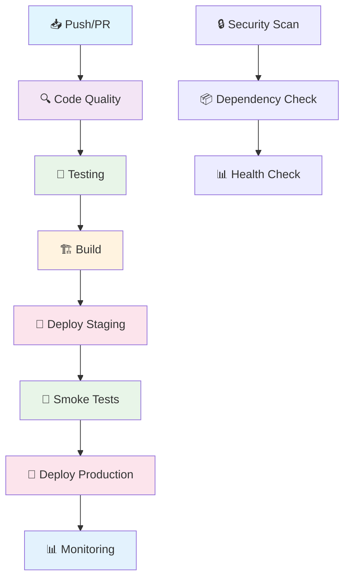

# 🚀 CI/CD Pipeline - UniFi Protect Notifications

Este documento describe el pipeline de CI/CD de alta gama implementado para el proyecto UniFi Protect Notifications.

## 📋 Características del Pipeline

### ✅ **Mejores Prácticas Implementadas**

- **🔍 Quality Gates**: ESLint, Security Audit, Code Coverage
- **🧪 Testing**: Unit tests, Integration tests, Multi-version testing
- **🛡️ Security**: CodeQL, Snyk, OWASP Dependency Check, Trivy
- **🏗️ Build**: Multi-stage Docker builds, Multi-architecture support
- **🚀 Deployment**: Staging → Production pipeline
- **📊 Monitoring**: Health checks, Performance monitoring
- **🔔 Notifications**: Slack, Discord, GitHub notifications

### 🎯 **Workflows Disponibles**

| Workflow | Descripción | Trigger |
|----------|-------------|---------|
| `ci-cd.yml` | Pipeline principal completo | Push/PR a main/develop |
| `security.yml` | Escaneo de seguridad | Diario + Push/PR |
| `dependency-update.yml` | Actualización de dependencias | Semanal |
| `deploy.yml` | Deployment automático | Después de CI exitoso |
| `monitoring.yml` | Monitoreo y alertas | Cada 5 minutos |

## 🏗️ Arquitectura del Pipeline



## 🔧 Configuración Requerida

### 🔐 **Secrets de GitHub**

Configura los siguientes secrets en tu repositorio (opcionales):

```bash
# Deployment (si usas Kubernetes)
KUBE_CONFIG=your_kubeconfig_base64
DOCKER_REGISTRY_TOKEN=your_registry_token

# Notifications externas (opcional)
SLACK_WEBHOOK=https://hooks.slack.com/services/YOUR/SLACK/WEBHOOK
DISCORD_WEBHOOK=https://discord.com/api/webhooks/YOUR/DISCORD/WEBHOOK
```

### 📦 **Dependencias Adicionales**

Agrega estas dependencias a tu `package.json`:

```json
{
  "devDependencies": {
    "audit-ci": "^6.0.0",
    "jest": "^29.7.0",
    "@types/jest": "^29.5.0",
    "ts-jest": "^29.1.0"
  }
}
```

## 🚀 Uso del Pipeline

### 📥 **Triggers Automáticos**

- **Push a `main`**: Ejecuta pipeline completo → Deploy a Production
- **Push a `develop`**: Ejecuta pipeline completo → Deploy a Staging
- **Pull Request**: Ejecuta solo Quality Gates y Testing
- **Schedule**: Ejecuta Security Scan y Dependency Check

### 🎮 **Triggers Manuales**

```bash
# Deploy manual a staging
gh workflow run "CI/CD Pipeline - UniFi Protect Notifications" \
  --field environment=staging

# Deploy manual a production
gh workflow run "CI/CD Pipeline - UniFi Protect Notifications" \
  --field environment=production

# Force deploy (ignora tests fallidos)
gh workflow run "CI/CD Pipeline - UniFi Protect Notifications" \
  --field environment=production \
  --field force_deploy=true
```

## 📊 Monitoreo y Alertas

### 🏥 **Health Checks**

- **Staging**: `https://staging.unifi-protect.example.com/health`
- **Production**: `https://unifi-protect.example.com/health`

### 📧 **Notificaciones**

- **GitHub**: Notificaciones nativas y issues automáticos para dependencias
- **Slack/Discord**: Opcionales (configurar secrets si se desea)

### 📈 **Métricas**

- **Code Coverage**: Mínimo 80%
- **Security**: Sin vulnerabilidades críticas
- **Performance**: < 200ms response time
- **Uptime**: 99.9% target

## 🔒 Seguridad

### 🛡️ **Escaneos Implementados**

1. **CodeQL**: Análisis estático de código
2. **npm audit**: Auditoría de paquetes
3. **OWASP**: Dependency Check
4. **Trivy**: Escaneo de imágenes Docker
5. **audit-ci**: Auditoría de dependencias

### 🔐 **Mejores Prácticas**

- Escaneo de vulnerabilidades diario
- Dependencias actualizadas semanalmente
- Auditoría de código con CodeQL
- Escaneo de contenedores con Trivy

## 🐳 Docker

### 🏗️ **Multi-stage Build**

```dockerfile
# Optimizado para producción
FROM node:18-alpine AS base
# ... configuración base

FROM base AS dependencies
# ... instalación de dependencias

FROM base AS build
# ... compilación

FROM base AS production
# ... imagen final optimizada
```

### 🏷️ **Tags Automáticos**

- `latest`: Última versión en main
- `develop`: Última versión en develop
- `{branch}-{sha}`: Versiones específicas
- `{version}`: Tags de release

## 📋 Checklist de Deployment

### ✅ **Pre-deployment**

- [ ] Tests pasando
- [ ] Security scan limpio
- [ ] Code coverage > 80%
- [ ] Dependencies actualizadas
- [ ] Environment variables configuradas

### ✅ **Post-deployment**

- [ ] Health check exitoso
- [ ] Smoke tests pasando
- [ ] Monitoring activo
- [ ] Logs sin errores
- [ ] Performance dentro de rangos

## 🚨 Troubleshooting

### ❌ **Pipeline Falla**

1. **Revisar logs** en GitHub Actions
2. **Verificar secrets** configurados
3. **Comprobar dependencias** actualizadas
4. **Revisar tests** locales

### ❌ **CodeQL Error: "Resource not accessible by integration"**

Este error ocurre cuando el token de GitHub no tiene permisos suficientes. **Soluciones:**

1. **Verificar permisos del repositorio:**
   - Ve a Settings → Actions → General
   - Asegúrate de que "Workflow permissions" esté configurado correctamente

2. **Usar el workflow simplificado:**
   - Renombra `security.yml` a `security-backup.yml`
   - Renombra `security-simple.yml` a `security.yml`
   - Este workflow evita CodeQL y usa solo npm audit + OWASP

3. **Configurar permisos manualmente:**
   - Ve a Settings → Actions → General
   - Selecciona "Read and write permissions"
   - Marca "Allow GitHub Actions to create and approve pull requests"

### ❌ **Deployment Falla**

1. **Verificar configuración** de environment
2. **Comprobar conectividad** a servicios
3. **Revisar logs** de aplicación
4. **Verificar recursos** disponibles

### ❌ **Health Check Falla**

1. **Verificar aplicación** ejecutándose
2. **Comprobar puertos** abiertos
3. **Revisar configuración** de red
4. **Verificar logs** de aplicación

## 📚 Recursos Adicionales

- [GitHub Actions Documentation](https://docs.github.com/en/actions)
- [Docker Best Practices](https://docs.docker.com/develop/dev-best-practices/)
- [Security Best Practices](https://docs.github.com/en/code-security)
- [Monitoring Best Practices](https://docs.github.com/en/actions/monitoring-and-troubleshooting-workflows)

## 🤝 Contribuir

Para contribuir al pipeline:

1. **Fork** el repositorio
2. **Crea** una rama para tu feature
3. **Implementa** tus cambios
4. **Prueba** localmente
5. **Abre** un Pull Request

---

**Desarrollado con ❤️ para la comunidad UniFi**
